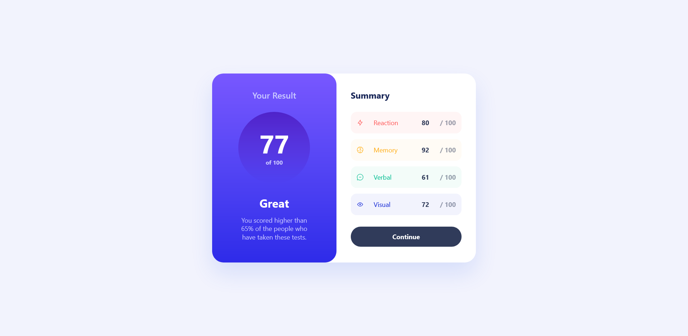
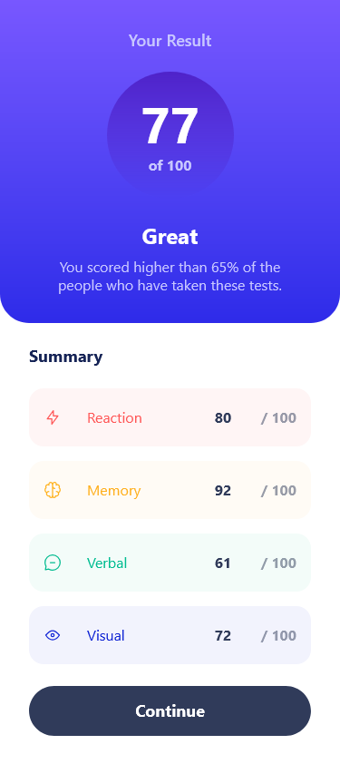

# Results Summary Component - Thomas Sifferle 📊


[](https://github.com/TomSif)
[](https://reactjs.org/)
[](https://vitejs.dev/)
[](https://tailwindcss.com/)
[](https://www.typescriptlang.org/)



### 🌐 Live Demo:

**[View live site →](https://front-end-mentor-results-summary-guq1w8dcc-tom-sifs-projects.vercel.app/)**

Deployed on Vercel with HTTPS and performance optimizations.

---

This is a solution to the [Results Summary Component challenge on Frontend Mentor](https://www.frontendmentor.io/challenges/results-summary-component-CE_K6s0maV). Frontend Mentor challenges help you improve your coding skills by building realistic projects.

## Table of contents

- [Overview](#overview)
  - [The challenge](#the-challenge)
  - [Screenshot](#screenshot)
  - [Links](#links)
- [My process](#my-process)
  - [Built with](#built-with)
  - [What I learned](#what-i-learned)
  - [Continued development](#continued-development)
- [Author](#author)
- [Acknowledgments](#acknowledgments)

## Overview

### The challenge

Users should be able to:

- View the optimal layout for the app depending on their device's screen size
- See hover states for all interactive elements on the page
- View their result summary with a score breakdown by category

**Extended version:** The original challenge is a purely static display. I extended it to make it educationally richer — the user can now enter their own score (0–100) for each of the 4 categories, hit "Continue" to trigger the calculation, and see a dynamic score and feedback level update in real time.

### Screenshot



### Links

- Solution URL: [GitHub Repository](https://github.com/TomSif/Front-End_Mentor_Results-Summary-App/tree/main)
- Live Site URL: [Vercel Deployment](https://front-end-mentor-results-summary-guq1w8dcc-tom-sifs-projects.vercel.app/)

## My process

### Built with

- Semantic HTML5 markup (`dl`, `dt`, `dd` for category lists)
- CSS custom properties
- Mobile-first workflow
- [React 19](https://react.dev/) - JS library
- [TypeScript](https://www.typescriptlang.org/)
- [Vite](https://vitejs.dev/) - Build tool
- [Tailwind CSS v4](https://tailwindcss.com/) - Utility-first CSS (`@tailwindcss/vite` plugin, `@theme` variables, `@utility` presets)
- [clsx](https://github.com/lukeed/clsx) + [tailwind-merge](https://github.com/dcastil/tailwind-merge) — `cn()` utility for conditional classNames

### What I learned

#### Extending the brief — a deliberate architectural decision

The original challenge is a static afficheur: data comes in, a fixed score goes out, nothing is interactive. I chose to extend it in a way that stays faithful to the design while unlocking the core React concepts I wanted to practise: controlled inputs, state lifting, and event-driven recalculation.

The extension is minimal but meaningful: four editable score inputs (one per category), a "Continue" button that acts as a form submit, and a live average displayed in the result panel with a dynamic feedback message based on five levels (`unknown → Bad → Poor → Fair → Great`). The structure of `data.json` remained the source of truth for categories and default values.

This was a conscious methodological choice — **data-first TypeScript** — where I derived my interfaces from the shape of the actual JSON rather than imagining the architecture upfront. It produced leaner, more accurate types than my previous project's (Pomodoro) type-first approach.

#### Lifting state and the `onScoreChange` pattern

The core interaction required `SummaryItem` (a child) to communicate upward to `App` (the parent) every time a score changed. This is the classic state-lifting pattern, and getting the TypeScript right was the main friction point.

```ts
// In the interface:
onScoreChange: (category: string, value: number) => void

// In App — updating a single key in the scores object:
const handleScoreChange = (category: string, value: number) => {
  setScores(prev => ({ ...prev, [category]: value }))
}
```

Two TypeScript patterns became much clearer here: the syntax for function types in interfaces (`(param: Type) => ReturnType`), and **computed property names** (`[category]: value`) for dynamic object keys. Both tripped me up more than once before clicking.

#### `useEffect` + `setInterval` — animation and cleanup

The score display in the result panel counts up from 0 to the final value when "Continue" is pressed, using a `setInterval` inside a `useEffect`. This seems simple but has several non-obvious constraints:

```ts
useEffect(() => {
  setDisplayScore(0); // reset before starting
  const interval = setInterval(() => {
    setDisplayScore((prev) => {
      if (prev >= scoreResult) {
        clearInterval(interval);
        return scoreResult;
      }
      return prev + 1;
    });
  }, 10);
  return () => clearInterval(interval); // cleanup on unmount or re-trigger
}, [scoreResult]);
```

Three points I had to work through explicitly:

- **Why `prev + 1` and not just `displayScore + 1`** — closures inside `setInterval` capture a stale value of the state. The functional form (`prev => prev + 1`) always reads the latest value.
- **Where `clearInterval` goes** — both inside the `setState` callback (to stop when target is reached) and in the cleanup return (to cancel if the effect re-runs).
- **Why reset to `0` first** — without it, a second submit would skip the animation entirely, since the state already equals the new value.

The fade-in on the feedback text (`isAnimationOver` + `transition-opacity`) followed the same pattern: a boolean state toggled at the end of the counting animation, triggering a CSS opacity transition via Tailwind.

#### CSS `::before` for button hover states

Rather than a second DOM element or a JavaScript toggle, hover and active states on the "Continue" button are handled entirely via a `::before` pseudo-element with an opacity transition. The button is `position: relative`, the overlay is `position: absolute` with `inset-0`, and `opacity` goes from 0 to 1 on `:hover`.

```css
.btn-gradient::before {
  content: "";
  position: absolute;
  inset: 0;
  background: linear-gradient(...);
  opacity: 0;
  transition: opacity 0.2s ease;
}
.btn-gradient:hover::before {
  opacity: 1;
}
```

This pattern keeps the hover effect purely in CSS with no React state involved — useful whenever the interaction is purely visual.

#### Tailwind dynamic classes — a firm rule

Early in the project, I tried to build Tailwind classes at runtime with template literals: `text-${color}`. It doesn't work, and the reason is architectural: Tailwind's class scanner runs at build time, so any class not present as a full static string in the source will not be included in the output.

The fix: a static lookup object mapping category names to their full Tailwind class strings. This is now a firm reflex — if a class needs to vary, a lookup map is the right tool.

#### Atomic commits — active practice

This project was the first where I applied the **socratic commit protocol** actively: pausing before each commit to choose which files to stage, write a scoped message, and verify that the message describes a single intent. `git add` with explicit filenames (rather than `git add .`) was new practice, as was catching the `&` signal — if a commit message needs `&`, it's two commits.

Four atomic commits were made across the responsive + accessibility + animation session, each scoped to a single concern: `feat(responsive)`, `feat(css)`, `feat(A11y)`, `fix(config)`.

#### Accessibility — `sr-only` labels on inputs

Each score input in `SummaryItem` has a visually hidden label (`sr-only`) that describes its purpose for screen readers. The visible category name (`dt`) and the icon provide context visually, but an unlabelled `<input>` is invisible to assistive technology.

```tsx
<label htmlFor={id} className="sr-only">{category} score</label>
<input id={id} type="number" ... />
```

Also: `onFocus` → `e.target.select()` to auto-select the input content on click, improving UX for a score field the user will typically want to replace entirely.

#### TypeScript config — `"types": ["vite/client"]`

A build error on Vercel exposed a tsconfig subtlety: this project has `noUncheckedSideEffectImports: true`, which is stricter than my previous Pomodoro setup. The standard `vite-env.d.ts` reference wasn't enough — adding `"types": ["vite/client"]` to `tsconfig.app.json` is the clean alternative that makes Vite's ambient types available without a manual reference file.

### Continued development

- **`useEffect` timer logic** — the `setInterval` pattern is understood conceptually but isn't fully automatic yet. Specifically: when to use the functional setState form, where exactly to place `clearInterval`, and how to reason about cleanup. This pattern appears often enough that it needs to become a reflex.
- **TypeScript function types** — the `(param: Type) => void` syntax in interfaces still requires conscious effort. It needs to become as automatic as `string` or `number`.
- **Computed property names** — `{ ...obj, [key]: value }` is now understood, but I still hesitate. The mental model (brackets = evaluate this expression as a key) needs more repetition before it's truly anchored.
- **Static Tailwind lookup maps** — the "no dynamic class names" rule is clear. Next step: making the static map the first instinct, not the fallback after the template literal fails.

## Author

- Frontend Mentor - [@TomSif](https://www.frontendmentor.io/profile/TomSif)
- GitHub - [@TomSif](https://github.com/TomSif)

## Acknowledgments

This project was built with AI-assisted mentoring (Claude). The approach: I code by hand, Claude acts as a Socratic mentor — asking questions, explaining concepts, reviewing my reasoning. Architectural decisions (what to extend, how to structure state, when to split a component) stayed mine.

Specific AI contributions are documented transparently in my [progression log](./progression.md):

- **Written by Claude:** project scaffold (`chore/setup` commits), TypeScript utility types when syntax was blocked
- **My initiative:** the decision to extend the challenge with editable inputs, the `data-first` interface derivation approach, building `ResultCard` without assistance, identifying `isAnimationOver` placement
- **Collaborative:** debugging the `setInterval` + functional setState pattern, working through computed property names, code review and commit scoping
